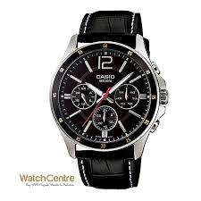

<!-- markdownlint-disable MD033 -->

<figure class="figure">
    
    <figcaption class="figure__caption">Title</figcaption>
</figure>

One of my favorite models to come from the pinnacle of German watchmakers, the 1815 Chronograph is a testament to everything good that comes with a timer. Priced right around 35,000 euros based on the model, it features the in-house L951.5 movement with a 60-hour power reserve. It’s very classic appearance is perfectly balanced with the sportiness of a chronograph, and it’s an absolute pleasure to operate with its soft push buttons. The only drawback to the watch is A. Lange’s far-too-often small crown that is tough for those with larger hands to operate.

