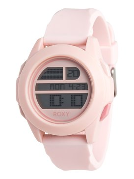

<!-- markdownlint-disable MD033 -->

<figure class="figure">
    
    <figcaption class="figure__caption">Title</figcaption>
</figure>

Arguably one of the most popular models produced by the manufacturer, the Lange I is a timepiece that’s as close to perfection as you’re going to get. Well priced between 25,000 and 35,000 euros, the watch is available in platinum and yellow or rose gold. The 38mm timepiece is a quintessential dress watch with that contemporary Eastern European flair. The new models have a larger balance wheel than the predecessor (which in my opinion was a better watch) and gives a more accurate reading. The only issue I really have with the Lange I is that they need to move the time indicator to the other side of the watch since it will almost always require a lift of the cuff to see it. Overall, an exemplary timepiece.