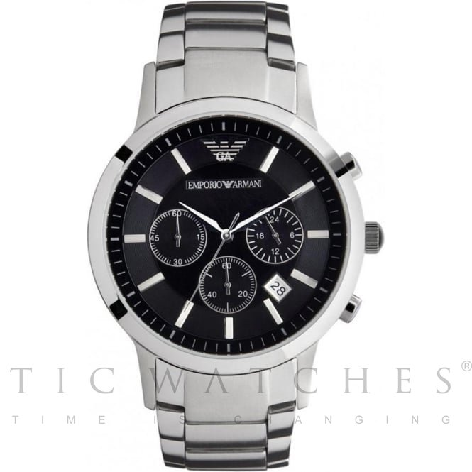

<!-- markdownlint-disable MD033 -->

<figure class="figure">
    
    <figcaption class="figure__caption">Title</figcaption>
</figure>

In my opinion, this is one of the most beautiful timepieces on the market. A limited edition, it’s priced reasonably at CHF 38,000. It is arguably the most coveted watch ever produced by Bovet and it’s not just because of its stunning aesthetics. Bovet must have realized they were lacking compared to their competition and upped their game by introducing this masterpiece. A manual seven day movement, it uses the in-house Virtuoso 2 movement. There are a few negatives but none that really affect the value or collectability of this timepiece. Overall, it’s not just the best watch from Bovet, but one of the best watches produced by any brand, ever.