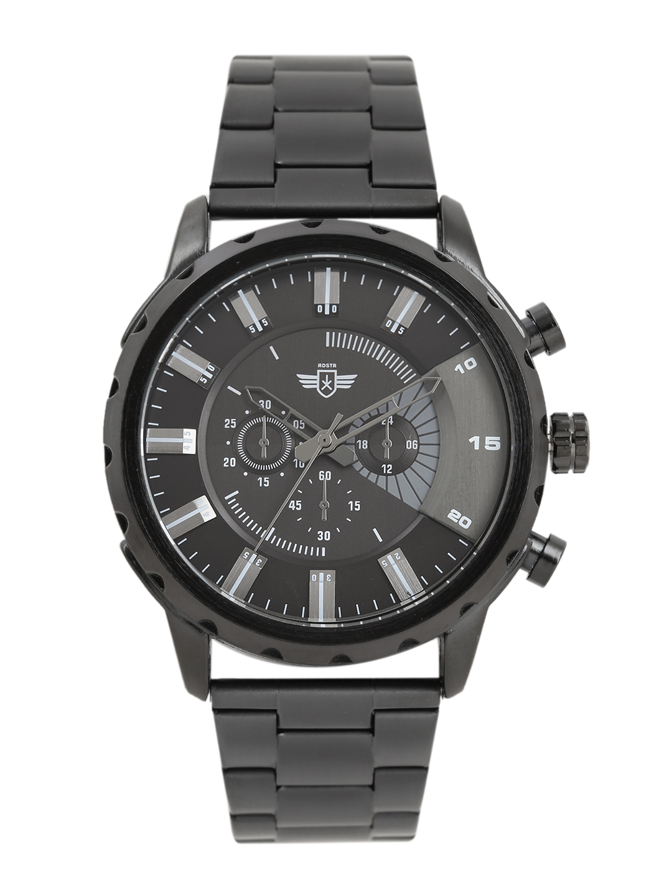

<!-- markdownlint-disable MD033 -->

<figure class="figure">
    
    <figcaption class="figure__caption">Title</figcaption>
</figure>

My favorite Breguet timepiece, the skeleton dial is what every other watchmaker should strive for. Undeniably beautiful with a movement that matches if not exceeds its aesthetic appeal, this timepiece is a true collectible for the aficionado. Priced right under CHF 275,000 for the rose gold model, this is probably one of my top ten favorite watches on this list.