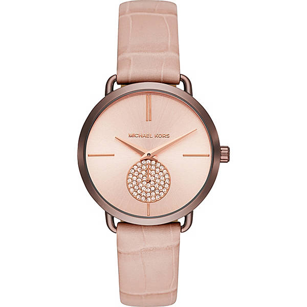

<!-- markdownlint-disable MD033 -->

<figure class="figure">
    
    <figcaption class="figure__caption">Title</figcaption>
</figure>

Like a window to heaven, the partially skeletonized dial offers a glimpse into the architecture and artistry of the ARM09 movement within. Like a perfected aria, the beauty of this timepiece is magnetic. As elegant as the movement is, the case is a little chunky, giving that retro appeal. Priced between CHF 22,000 and 32,000, the only big drawback is that the watch deserves to come with a nicer strap.