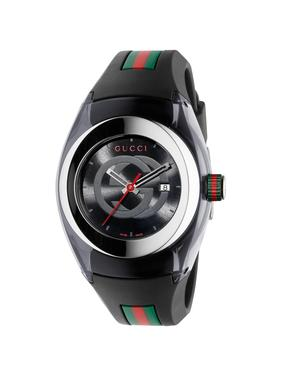

<!-- markdownlint-disable MD033 -->

<figure class="figure">
    
    <figcaption class="figure__caption">Title</figcaption>
</figure>

Designed by Frederic Garinaud, who is the brains behind the Harry Winston OPVS8, this timepiece, respectably priced at under CHF 40,000, houses a custom integrated column-wheel mono-pusher chronograph and offers the owner the unique opportunity to select between a tachymeter and pulsometer scale. An excellent selection for any gentleman, the one drawback is that its exceptionally bulky case measures in at 46mm. However, despite that, it’s still surprisingly comfortable on a larger wrist.