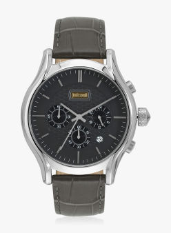

<!-- markdownlint-disable MD033 -->

<figure class="figure">
    
    <figcaption class="figure__caption">Title</figcaption>
</figure>

Forget the standard Submariner and Seamaster by Rolex and Omega, the X Fathoms by Blancpain is arguably the most eligible dive watch for deep-sea, unchartered-waters style dives. The decompression valve is easy to use, it offers a double-depth gauge and a retrograde five minute sub-counter. Easy to read with maximum depth memory, its only drawback is that the advertised ‘orange’ glow disappears after the fifty-foot mark.