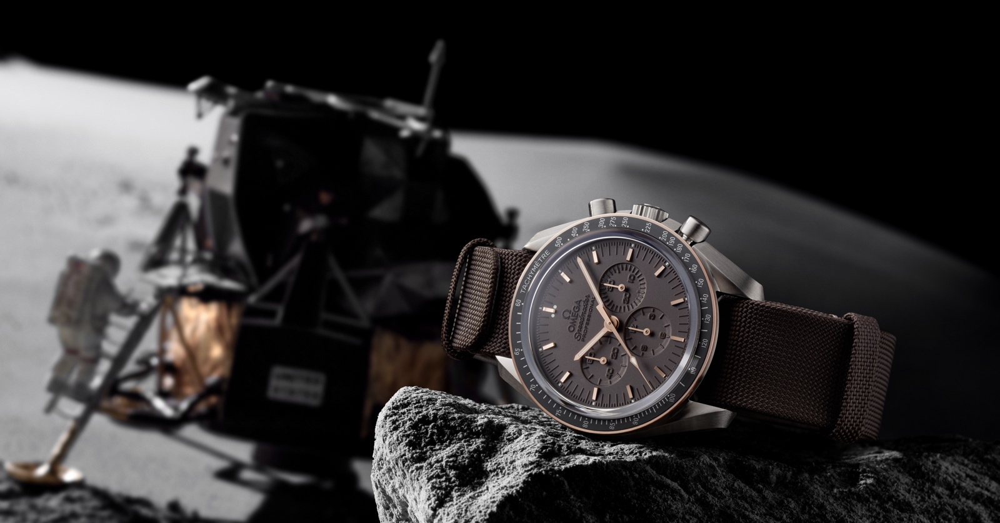

<!-- markdownlint-disable MD033 -->

<figure class="figure">
    
    <figcaption class="figure__caption">Title</figcaption>
</figure>

## Omega Speedmaster Apollo 11

A mens watch by Rolex embodies such, literally in the purest most real sense. Rolex, the epitome of success ! Picture someone being a descendant of pure depleted conditions, at the end of the month, you always find much more month than money. On monday your meal - noodles with “catch-up", on thuesday ketchup with noodles....  

Are you aware of the saying “ turn every penny twice “ ….

Absolutely regardless where in the world, there are always those in worse conditions...  this insight true, yet not paying the bills !

In principle we all might consider ourselfs lucky, `cause where there is the privileg to grow up within a country where education and a more or less functioning social system is the norm....  doors are open...   for sure not all, yet many !

Rolex embodies, especially as well in the music industry, an untouchable statement of peak. The artist, sing and songwriter “ Drake “ for sure familiar to many, as much as his song “ Nonstop “ ….   - an hommage to this mens watch by Rolex. The following textline flows through this song:

„ This a Rollie, not a stopwatch, sh*it don't ever stop ” -    Drake