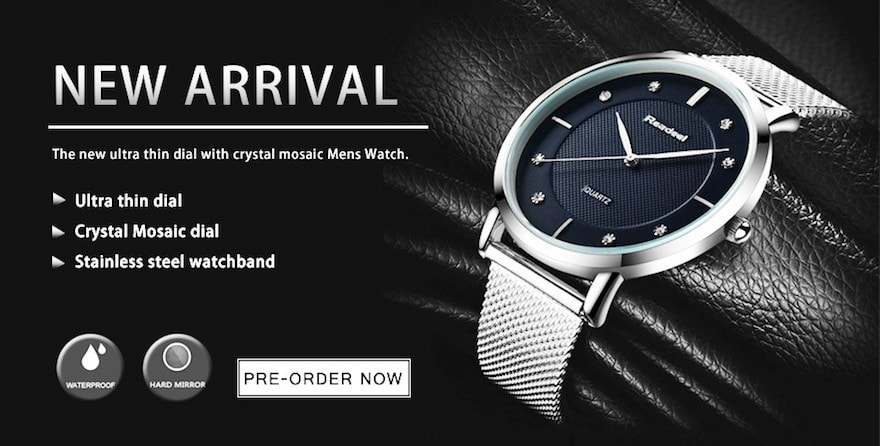

<!-- markdownlint-disable MD033 -->

<figure class="figure">
    
    <figcaption class="figure__caption">Title</figcaption>
</figure>

## Watch Out

LThis menswatch a manufacture - descentdant by Audemars Piguet a legend amongst AP´s models. The distinctive face nuanced in variatons of brown, paired with the VIP octagonal bezel - eightfold screwed, made of stainless steel, reminds of a full grown lions paw.

„ The beast “ so the back than nickname of the Royal Oak Family – more than adequate.

At heart a manufactured calibre.

CEO´s citation: „ I did not study, i don´t have a degree and i am saying what i think “ vibrates crystal clear awareness towards the self, towards the context and provokes focus. A degree – no guarantor for success in the broadest sense.

Back than, when all began, the personal target was to aquire any ever produced swatch watch originally wrapped - to generate a completely full sorted collection. A target that was seen as inconceivable. How did that man manage to succeed nonetheless ?

The excitement. To make the unattainable – attainable and in favour to that, the full concentration onto a clear target. Every move known beforehand, the preparations ready for operation and 100% on sight.