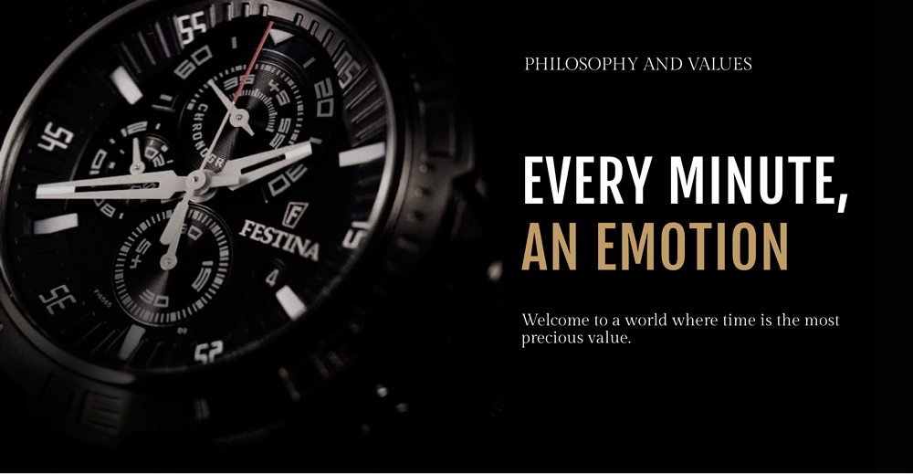

<!-- markdownlint-disable MD033 -->

<figure class="figure">
    
    <figcaption class="figure__caption">Title</figcaption>
</figure>

## Do you believe in new

Whether a top class collection, or the crack of the billion limit as AP´s CEO. Ingenious applied knowledge generates. Regardless of which ingenious source the knowlege derives from. It depends on the implementation, on the certain flavoured thrive, on the focus and on the intuition for the right moment. Audemars Piguet Royal Oak Offshore.

Royal Oak Offshore Havana – a lions paw. Full of power - while at the same time soft and gentle. At the right time, the right quality and the full power is developed.

Focus and awareness, that never question the confidence towards the self, towards the project. Adressed is here a focus that focuses and at the same time watches wide beyond the focus and sees.

The lion, „The Beast “, CEO Francois Bennahmieas, … focus that goes way beyond focus and sees .

