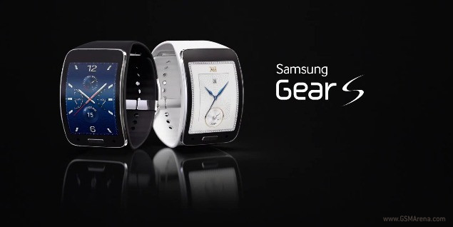

<!-- markdownlint-disable MD033 -->

<figure class="figure">
    
    <figcaption class="figure__caption">Title</figcaption>
</figure>

## Gear S

One man consistently and firmly believed in the brand, he had a vision! His name Angelo Bonati. Thanks to him the brand survived, he dreamed, where others passed out long time ago. The U-shaped lugs, the black sandwich face with the milled out indexes and figures, the cushion-like case…. all of that not conceivable back than.

Today all of that is marking the brand with a very explicit recognition value. A value that has flown the brand to where she positions up to date.

Do you know the saying: „ First they ask you, why you are doing such. Later they ask you how you are doing such … „    This saying – an hommage to life itself !

Having big dreams one gets declared as being a „ dreamer „ in a flash.

„ Come on … Get back to reality „ - classic proposition !

Think of this mens watch, think of this brand …. Panerai !

A man, A vision.  One would still be called a dreamer today ?
