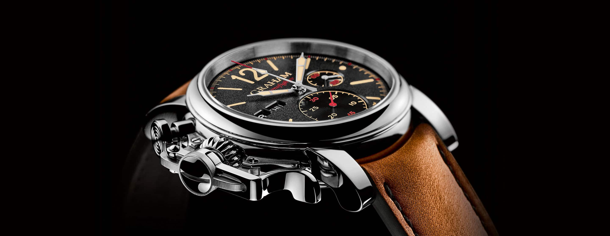

<!-- markdownlint-disable MD033 -->

<figure class="figure">
    
    <figcaption class="figure__caption">Title</figcaption>
</figure>

## Only for the greatest

The end of the race and standing on that pedestal. Enjoying summer at the beach with that bikini body…  To cruise along the coast in that Ferrari, open rooftop… the wind blowing …. 

Magnificient, right ?

It´s the visions, that wanna be caught…   Those magnificient pictures in the head – that wanna be lived !

This mens watch by TAG Heuer, composed in stainless steel with an immense powerful black color as main character. A tachymeter bezel and intense accentuated Indexes – with a very clear message. The path targets front side ! 

Very dynamic – very provoking ! Endurance and clear focus !

The strap made of rubber perseverse… Very resistant and high longevity.

Regardless the up to date situation … who wants to move from A to B, requires in most cases 2 main qualities: Perseverence and focus !
