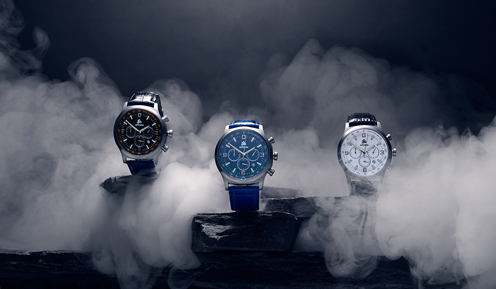

<!-- markdownlint-disable MD033 -->

<figure class="figure">
    
    <figcaption class="figure__caption">Title</figcaption>
</figure>

## Security on another level
Imagine driving along the high way. Speed limitation not an option right now. Your car is driving on the right lane – driving unhurried. One gaze upon the left exterior mirror and in sensed-like milliseconds a sportscar speeds by…. Hardly perceivable would it not be for the unmistakable sound and the gooseflesh left as greetings.

Well, what has all of that to do with Zenith´s mens watch Defy El Primero 21 ?

A) measurement up to one hundredth of a second is standard, measuring how long it did take for the sportscar to speed by. Thanks to the one step ahead – the chronograph engine is top in measuring hundredth of a second – hear that ?

B) the regular engine of this timepiece drives thanks to the high frequency vibration on the left lane, for you as a car driver this means advantage in terms of reaching the destination or goal faster, for you as watch enthusiast – this means ultra high level precision regarding time accuracy and top action regarding the watch´s power reserve !